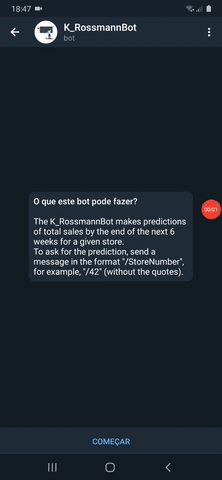
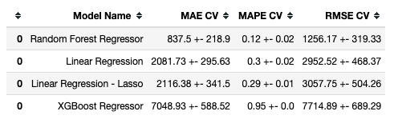

# Rossmann stores sales prediction

---

# 1.0 The context

In a quarterly report meeting at Rossmann, the directors board identified an increase in competitors stores openings.

In order to prevent the competitors from taking part of the market share, the C-Level board decided to conduct an on-site survey with all customers who were shopping at the stores to understand the following points:

- Why did the customer preferred to buy from Rossmann and not from the competition?
- From 0 to 10, how satisfied was the customer with the Rossmann store's products and service? Why? (CSAT)
- Why were there certain products that the customer preferred to buy from the competition and not from Rossmann?
- What were, in the customers opinions, the three strengths and three weaknesses from Rossmann’s stores? Why?
- From 0 to 10, how much would the customer recommend Rossmann to a friend or family member? Why? (NPS)

After the customer survey, the following insights were identified:

- Customers preferred to buy from the competition because the service was better.
- Customers bought the same product from the competition because it offered better prices.
- Customers preferred to go to the competition’s store because the physical environment were more pleasant and some even had a cafeteria chain inside them.

 

# 2.0 The problem
Based on the research insights, initiatives have been outlined such as: 

- Redesign the entire training program for store managers and attendants.
- Review the entire pricing strategy.
- Make partnerships with chains of coffee shops and bakeries.
- Deploy self-service totems to customers who preferred to shop without the assistance of attendants.

However, to carry out all these initiatives, well-structured financial planning with a minimum margin of error must be made so that the company wouldn't waste money during the implementation of the initiatives.

The CFO responsible for this plan had a huge difficulty to carry it out because it was necessary to know how much each store was selling and **how much it could sell in the short term**. In addition, there was no easy, automated, or convenient way to obtain this information.

 

# 3.0 The solution
The delivered solution was a Telegram bot. 

The user just needed to send the store number and the bot would answer the predicted **total sales that the store would made by the end of the next six weeks**.

 

## 3.1 What drove the solution
### 3.1.1 Exploratory Data Analysis

#### Descriptive analysis

Key points:
- The **mean sales** value is around **US$ 5,773.82**. 

- There was a **maximum of 7,388 customers** in a single day.

- In addition, there are **competitor stores really near (20 m)** from Rossmann's stores.

 

#### Hypothesis Map
We outlined this map to help us to decide which variables we need in order to validate the hypotheses.

 

#### Univariate Analysis

As we can observe, the majority of sales lies around US$ 5,700.

In addition, the distribution is **moderately skewed** (`skewness = 0.641460`) and presents a **positive kurtosis** (`1.778375`) which means that we have some possible outliers in our dataset. Thus, the distribution **does not follow a normal distribution**.

 

### Hypothesis validation - Bivariate Analysis

#### Main Hypotheses

**H2. Stores with nearer competitors should have lesser sales.**

As we can observe from the bar plot, **stores with nearer competitors have higher sales**. In addition, we can observe from the scatter plot that we have a higher concentration of sales as we decrease the competition distance.

> #### Thus, our hypothesis is **FALSE**.

**Correlations**

As observed in the results, the Pearson's correlation coefficient between `competition_distance` and `sales` is `-0.23` which tells us that is a **weak negative correlation**. Despite the weakness, we may include the `competition_distance` because it has a somewhat influence on the target variable (`sales`).

 

**H4. Stores with longer period of time in promotion should have higher sales.**

As there is a lot of data, we divided the dataset in two periods: regular promotion and extended promotion.

As we can observe in the **Total sales x Weeks in extended promotion**, there's a period in which the extended promotion results in more sales, then after a period of time, the total sales starts to decrease.

From the **Total sales x Weeks in regular promotion**, we can observe that as the offset gets more and more near zero, the sales starts to increase.

Thus, **stores with longer period of time in promotion don't have higher sales.**, because the sales start to decrease as the promotion gets longer. 

> #### Thus, the hypothesis is **FALSE**.

**Correlations**

In addition, from the **Correlation Heatmap** we got a coefficient of `-0.029` which is pretty close to `zero`. Thus, we have a **super weak correlation**, which makes sense because looking at our data, we have long periods of almost constant total sales (see  **Total sales x Weeks in extended promotion**).

 

**H6. Stores with higher consecutive promotions should have higher sales.**

Observing the results it seems that **stores with higher consecutive promotions don't have higher sales**. 

> #### Thus, our hypothesis is **FALSE**.

 

**H9. Stores should have higher sales on the second semester of the year.**

As observed in the previous results, stores **don't have higher sales on the second semester of the year**. In addition, by observing the Pearson correlation coefficient of `-0.75`, we can verify that there is a **strong negative correlation** between `month` and `sales`. 

> #### Thus, our hypothesis is **FALSE**.

 

#### Hypotheses summary
We also outlined other hypotheses, but the previous presented ones were the most insightful.

| Hypothesis | Conclusion | Relavance to ML model |
| --------------- | --------------- | --------------- |
| H1 | False | Low |
| H2 | False | Medium |
| H3 | False | Medium |
| H4 | False | Low |
| H5 | (later analysis) | (later analysis) |
| H6 | False | Low |
| H7 | False | Medium |
| H8 | False | High |
| H9 | False | High |
| H10 | True | High |
| H11 | True | High |
| H12 | True | Low |

 

### Multivariate Analysis

As observed in the matrix above:

| Variable A | Variable B | Correlation |
| --------------- | --------------- | --------------- |
| `day_of_week` | `open` | Medium |
| `day_of_week` | `sales` | Medium |
| `day_of_week` | `promo` | Weak |
| `day_of_week` | `school_holiday` | Weak |
| `open` | `promo` | Weak |
| `open` | `customer` | Strong |

These correlations guided us on the selection of which variables to include in the model. This could be translated into **more assertiveness on the predictions** which means **better budget planning** and **less wasted money**.

 

### 3.1.3 Machine Learning

As observed in the results, the Random Forest Regressor had the least MAE (`837.5 +- 218.9`). However, we done a fine tuning in the **XGBoost Regressor** to experiment if could also be a potential candidate.

#### After tuning the model:

As we can see, there was a great improvement compared to the previous results.

 

### 3.1.4 Business Performance

As we can observe in the sample above, we have both **best and worst scenarios** for the total sales, so we can have a range in which we can base the budget estimations.

 

**MAPE x error**

There are stores that are more difficult to make the predictions (circled in red). Thus, some strategies that may solve this challenge in the next project iteration could be:

 - Taking a closer look on the variables (add or remove).
 - Try other methods and other techniques in order to improve the predictions.

 

### 3.1.5 Machine Learning Performance

Observing the results, we can see that:
- By observing the **first and second line plots**, we can see that the predictions or our model is pretty close to the real value for `sales`. On the other hand, the error rate has some variance.

- By observing the **histogram**, the error distribution almost follows a normal distribution. 

- By observing the **scatterplot** for the errors, the points seems well fit in a horizontal tube which means that there's a few variation in the error. If the points formed any other shape (e.g opening/closing cone or an arch), this would mean that the errors follows a trend and we would need to review our model.

 

# 4.0 Next Steps
- Experiment with other Machine Learning algorithms to improve business performance by 10%.
- Experiment with selecting other features to see how much the RMSE is impacted.
- Experiment with other hyperparameter fine-tuning strategies to see how much the RMSE is impacted.
- Improve bot messages  and its interaction with users.

---

If you're interested in reading the full detailed story and more tech-oriented, please, visit: https://github.com/brunokatekawa/Curso_DS_Prod